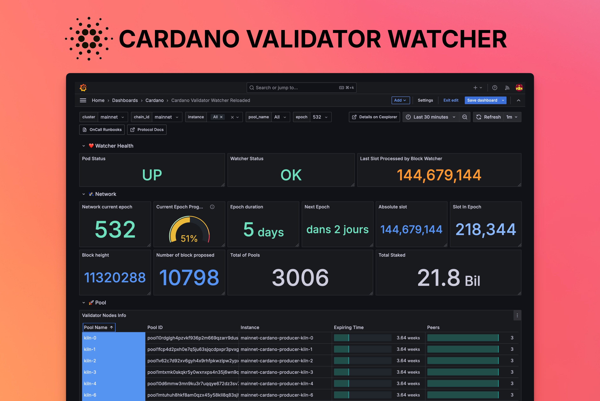

# Cardano Validator Watcher

**Cardano Validator Watcher** is a Prometheus exporter designed to help you monitor your Cardano validator nodes. It periodically collects essential metrics, providing valuable insights into the performance and health of your infrastructure. These exported metrics can be used to build monitoring dashboards _(e.g with Grafana)_ and configure alerting rules to stay notified when something goes wrong.



## Dependencies

This project use the following dependencies:

- [BlockFrost](https://blockfrost.dev/). You need to have a account and a subscription.
- [cncli](https://github.com/cardano-community/cncli) to calculate the slot leaders.
- [cardano-cli](https://github.com/IntersectMBO/cardano-cli) to query additional data from a RPC node.
- A valid RPC node.
- Download the [Genesis configuration files](https://book.world.dev.cardano.org/environments.html) and provide the VRF signing key for each monitored pool.

## Usage

To start the watcher, you need to open a socket connection with your Cardano node. This can be done using the following commands:

### With Kubernetes
```bash
kubectl port-forward pod/<POD_NAME> 3002 &
socat UNIX-LISTEN:/tmp/cardano.socket,fork,reuseaddr,unlink-early, TCP:127.0.0.1:3002
```

### Without Kubernetes
```bash
socat UNIX-LISTEN:/tmp/cardano.socket,fork,reuseaddr,unlink-early, TCP:<IP>:<PORT>
```

Ensure that you have downloaded the [Genesis configuration files](https://book.world.dev.cardano.org/environments.html). You also need to provide the VRF signing key for each monitored pool.

Then, to start the watcher, execute the following command:

```bash
./cardano-validator-watcher [flags]
```

### Flags

| Flag                                  | Description                                                                           | Default Value             | Required |
|---------------------------------------|---------------------------------------------------------------------------------------|---------------------------|----------|
| `--config`                            | Path to the configuration file                                                        | `config.yml`              | No       |
| `--log-level`                         | Log Level                                                                             | `info`                    | No       |
| `--http-server-host`                  | Host on which the HTTP server should listen                                           | `127.0.0.1`               | No       |
| `--http-server-port`                  | Port on which the HTTP server should listen                                           | `8080`                    | No       |
| `--network`                           | Cardano network ID                                                                    | `preprod`                 | Yes      |
| `--database-path`                     | Path to the local database mainly used by the Cardano client                          | `watcher.db`              | No       |
| `--cardano-config-dir`                | Path to the directory where Cardano configuration files are stored                    | `/config`                 | No       |
| `--cardano-timezone`                  | Timezone to use with cardano-cli                                                      | `UTC`                     | No       |
| `--cardano-socket-path`               | Path of the socket to communicate with a Cardano node                                 | `/var/run/cardano.socket` | No       |
| `--blockfrost-project-id`             | Blockfrost project ID                                                                 |                           | Yes      |
| `--blockfrost-endpoint`               | Blockfrost API endpoint                                                               |                           | Yes      |
| `--blockfrost-max-routines`           | Number of routines used by Blockfrost to perform concurrent actions                   | `10`                      | No       |
| `--blockfrost-timeout`                | Timeout for requests to the Blockfrost API (in seconds)                               | `60`                      | No       |
| `--block-watcher-enabled`             | Enable block watcher                                                                  | `True`                    | No       |
| `--block-watcher-refresh-interval`    | Interval at which the block watcher collects and processes slots (in seconds)         | `60`                      | No       |
| `--pool-watcher-enabled`              | Enable pool watcher                                                                   | `True`                    | No       |
| `--pool-watcher-refresh-interval`     | Interval at which the pool watcher collects data on monitored pools (in seconds)      | `60`                      | No       |
| `--network-watcher-enabled`           | Enable network watcher                                                                | `True`                    | No       |
| `--network-watcher-refresh-interval`  | Interval at which the network watcher collects data related to network (in seconds)   | `60`                      | No       |
| `--status-watcher-refresh-interval`   | Interval at which the status watcher collects data related to health (in seconds)     | `15`                      | No       |

## Configuration

The watcher uses a `config.yaml` file in the current working directory by default. Use the `--config` flag to specify a different configuration file.

### Full Example
```yaml
pools:
  - instance: "cardano-producer-pool-0"
    id: "pool1abcd1234efgh5678ijklmnopqrstuvwx"
    name: "pool-0"
    key: "config/pool-0.vrf.skey"
  - instance: "cardano-producer-pool-1"
    id: "pool2abcd1234efgh5678ijklmnopqrstuvwx"
    name: "pool-1"
    key: "config/pool-1.vrf.skey"
    exclude: true
    allow-empty-slots: true
network: "mainnet"
block-watcher:
  enabled: true
  refresh-interval: 30
pool-watcher:
  enabled: true
  refresh-interval: 30
network-watcher:
  enabled: true
  refresh-interval: 30
status-watcher:
  enabled: true
  refresh-interval: 15
database:
  path: "watcher.db"
blockfrost:
  project-id: "thisissecret"
  endpoint: "https://cardano-mainnet.blockfrost.io/api/v0"
  max-routines: 10
  timeout: 60
http:
  host: "0.0.0.0"
  port: 8080
cardano:
  config-dir: "config"
  socket-path: "/tmp/cardano.socket"
  timezone: "UTC"
```

### Pools Settings

| Field                     | Description                                               | Example                                                             |
|---------------------------|-----------------------------------------------------------|---------------------------------------------------------------------|
| `instance`                | Name of the instance                                      | `"cardano-producer-pool-0"`                                 |
| `id`                      | Pool ID                                                   | `"pool1abcd1234efgh5678ijklmnopqrstuvwx"`        |
| `name`                    | Name of the pool                                          | `"pool-0"`                                                          |
| `key`                     | Path to the key file                                      | `"config/pool-0.vrf.skey"`                                          |
| `exclude`                 | Exclude the pool from monitoring                          | `true`                                                              |
| `allow-empty-slots`       | Pools is allowed to not have slot leaders                 | `false`                                          |


### Global Settings

| Field      | Description             | Example       |
|------------|-------------------------|---------------|
| `network`  | Name of the network     | `"mainnet"`   |

```yaml
network: "mainnet"
```

### Block Watcher Settings

| Field                 | Description                                                             | Example   |
|-----------------------|-------------------------------------------------------------------------|-----------|
| `enabled`             | Enable block watcher                                                    | `True`      |
| `refresh-interval`    | Time, in seconds, between two consecutive collections of block data     | `60`      |

```yaml
block-watcher:
  enabled: true
  refresh-interval: 30
```

### Pool Watcher Settings

| Field                 | Description                                                             | Example   |
|-----------------------|-------------------------------------------------------------------------|-----------|
| `enabled`             | Enable pool watcher                                                     | `True`    |
| `refresh-interval`    | Time, in seconds, between two consecutive collections of pool data      | `60`      |

```yaml
pool-watcher:
  enabled: true
  refresh-interval: 30
```

### Status Watcher Settings

| Field                 | Description                                                             | Example   |
|-----------------------|-------------------------------------------------------------------------|-----------|
| `refresh-interval`    | Time, in seconds, between two consecutive collections of status data    | `60`      |

```yaml
status-watcher:
  refresh-interval: 30
```

### Network Watcher Settings

| Field                 | Description                                                             | Example   |
|-----------------------|-------------------------------------------------------------------------|-----------|
| `enabled`             | Enable network watcher                                                  | `True`    |
| `refresh-interval`    | Time, in seconds, between two consecutive collections of network data   | `60`      |

```yaml
network-watcher:
  enabled: true
  refresh-interval: 30
```

### Database Settings

| Field      | Description                                  | Example        |
|------------|----------------------------------------------|----------------|
| `path`     | Path to the database file                    | `"watcher.db"` |

```yaml
database:
  path: "watcher.db"
```

### Blockfrost Settings

| Field         | Description                                                                 | Example                                                 |
|---------------|-----------------------------------------------------------------------------|---------------------------------------------------------|
| `project-id`  | Blockfrost project ID                                                       | `"thisissecret"`                                        |
| `endpoint`    | Blockfrost API endpoint                                                     | `"https://cardano-mainnet.blockfrost.io/api/v0"`        |
| `max-routines`| Number of routines used by Blockfrost to perform concurrent actions         | `10`                                                    |
| `timeout`     | Timeout for requests to the Blockfrost API (in seconds)                     | `60`                                                    |

```yaml
blockfrost:
  project-id: "thisissecret"
  endpoint: "https://cardano-mainnet.blockfrost.io/api/v0"
  max-routines: 10
  timeout: 60
```

### HTTP Server Settings

| Field      | Description                                      | Example   |
|------------|--------------------------------------------------|-----------|
| `port`     | Port on which the HTTP server should listen      | `8080`    |

```yaml
http:
  host: "0.0.0.0"
  port: 8080
```

### Cardano Settings

| Field          | Description                                                  | Example                   |
|----------------|--------------------------------------------------------------|---------------------------|
| `config-dir`   | Path to the directory where Cardano configuration files are stored | `"config"`                |
| `socket-path`  | Path of the socket to communicate with a Cardano node        | `"/tmp/cardano.socket"`   |
| `timezone`     | Timezone to use with cardano-cli                             | `"UTC"`                   |

```yaml
cardano:
  config-dir: "config"
  socket-path: "/tmp/cardano.socket"
  timezone: "UTC"
```

## Metrics

| Metric Name                                                       | Description          | Type | Labels |
| ----------------------------------------------------------------- | -------------------- |---- | --- |
| `cardano_validator_watcher_pool_relay_count`                      | Number of relays associated with each pool                                  | GaugeVec    | `pool_name`, `pool_id`, `pool_instance` |
| `cardano_validator_watcher_pool_pledge_met`                       | Indicates whether the pool has met its pledge requirements or not (0 or 1)  | GaugeVec    | `pool_name`, `pool_id`, `pool_instance` |
| `cardano_validator_watcher_pool_saturation_level`                 | The current saturation level of the pool in percent                         | GaugeVec    | `pool_name`, `pool_id`, `pool_instance` |
| `cardano_validator_watcher_pool_drep_registered`                  | Whether the pool owner is registered to a DRep (0 or 1)                    | GaugeVec    | `pool_name`, `pool_id`, `pool_instance` |
| `cardano_validator_watcher_next_epoch_start_time`                 | Start time of the next epoch in seconds                                     | Gauge       | - |
| `cardano_validator_watcher_monitored_validators_count`            | Number of validators monitored by the watcher                               | Gauge       | - |
| `cardano_validator_watcher_missed_blocks`                         | Number of missed blocks in the current epoch                                | CounterVec  | `pool_name`, `pool_id`, `pool_instance`, `epoch` |
| `cardano_validator_watcher_consecutive_missed_blocks`             | Number of blocks missed consecutively.                                      | GaugeVec    | `pool_name`, `pool_id`, `pool_instance`, `epoch` |
| `cardano_validator_watcher_validated_blocks`                      | Number of validated blocks in the current epoch                             | CounterVec  | `pool_name`, `pool_id`, `pool_instance`, `epoch` |
| `cardano_validator_watcher_orphaned_blocks`                       | Number of orphaned blocks in the current epoch                              | CounterVec  | `pool_name`, `pool_id`, `pool_instance`, `epoch` |
| `cardano_validator_watcher_expected_blocks`                       | Number of expected blocks in the current epoch                              | CounterVec  | `pool_name`, `pool_id`, `pool_instance`, `epoch` |
| `cardano_validator_watcher_latest_slot_processed_by_block_watcher`| Latest slot processed by block watcher                                      | Gauge       | - |
| `cardano_validator_watcher_next_slot_leader`                      | Next slot leader for each monitored pool                                    | GaugeVec    | `pool_name`, `pool_id`, `pool_instance`, `epoch` |
| `cardano_validator_watcher_epoch_duration`                        | Duration of an epoch in days                                                | Gauge       | - |
| `cardano_validator_watcher_network_epoch`                         | Current epoch number                                                        | Gauge       | - |
| `cardano_validator_watcher_network_block_height`                  | Latest known block height                                                   | Gauge       | - |
| `cardano_validator_watcher_network_slot`                          | Latest known slot                                                           | Gauge       | - |
| `cardano_validator_watcher_network_epoch_slot`                    | Latest known epoch slot                                                     | Gauge       | - |
| `cardano_validator_watcher_network_network_pools_total`           | Total number of pools in the network                                        | Gauge       | - |
| `cardano_validator_watcher_network_blocks_proposed_current_epoch` | Number of blocks proposed in the current epoch by the network               | Gauge       | - |
| `cardano_validator_watcher_network_active_stake`                  | Total active stake in the network                                           | Gauge       | - |
| `cardano_validator_watcher_chain_id`                              | ID of the chain                                                             | Gauge       | - |
| `cardano_validator_watcher_health_status`                         | Health status of the Cardano validator watcher: 1 = healthy, 0 = unhealthy  | Gauge       | - |

